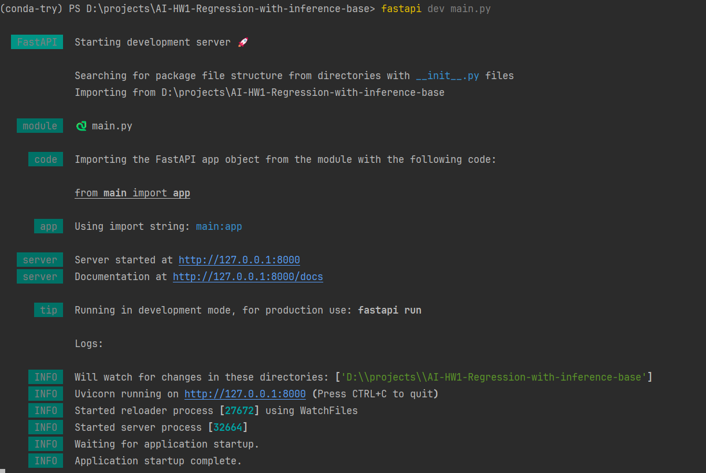
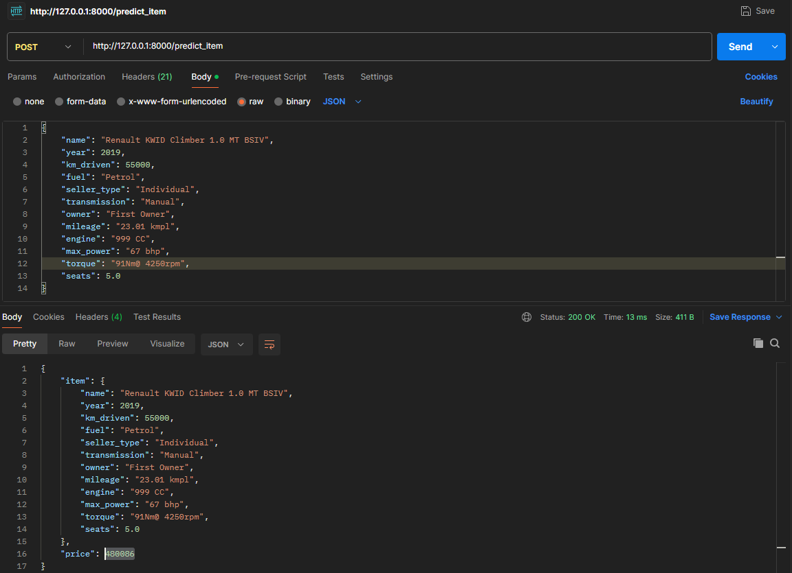
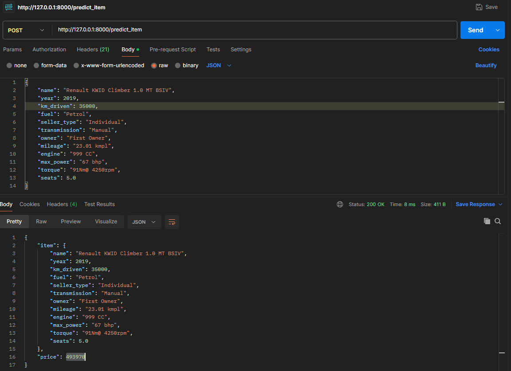
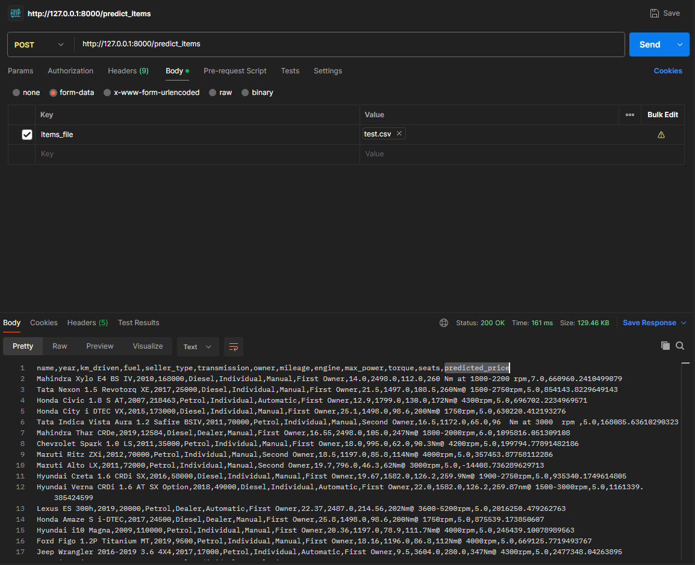

# Что было сделано
Выполнена предварительная обработка данных: 
* парсинг строковых значений к числовым, где это возможно
* заполнение отсутствующих значений медианными
* скаллирование значений
* энкодинг категориальных значений

Была выполнена визуализация данных для выполнения первичного анализа и выявления корреляций

Были построены модели с учетом разных видов признаков, для получившихся моделей были посчитаны MSE и R^2

Были подобраны оптимальные параметры для обучения модели с помощью GridSearch

Были посчитаны бизнесовые метрики

# С какими результатами
Удалось достичь

R^2: 0.5941419794788415

MSE: 233298779730.45566

на тестовых данных

Максимальные бизнесовые метрики, которых удалось достичь: 0.235

# Что дало наибольший буст в качестве
Использование GridSearchCV для подбора оптимальных параметров обучения
# Реализация сервиса на FastAPI
Код сервиса находится в файле main.py, он использует pipeline подготовленный в файле pipeline.py
Запуск сервера:

POST /predict_item:

Демонстрация что при изменении параметров автомобиля, изменяется и его прогнозируемая цена:

POST /predict_items:
